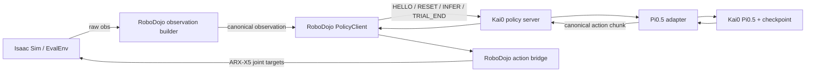

# Kai0 Pi0.5 × RoboDojo 集成指南

这套集成的目标不是把 Kai0 代码复制进 RoboDojo，而是明确分工：

- RoboDojo 拥有 Isaac Sim、任务、观测采集、动作执行和评测结果。
- Kai0 拥有 Pi0.5 模型、checkpoint 加载、推理配置和 policy server。
- 两边通过版本化的 `robodojo-policy-v1` WebSocket 协议通信。
- `third_party/kai0` 是 Git submodule，RoboDojo 只固定一个经过验证的
  Kai0 commit；实验性的 Kai0 branch 可以通过 Git worktree 独立运行。

## 1. 运行时数据流



一次 episode 的严格生命周期是：

```text
HELLO（每个连接一次）
  -> RESET（一个新 episode）
  -> INFER 0
  -> INFER 1
  -> ...
  -> TRIAL_END（正常、可确认的 episode 恰好一次）
  -> 下一次 RESET
```

RoboDojo 主动连接 Kai0 server。观测和请求由 RoboDojo 发出，Kai0 完成
推理并返回动作；动作最终仍由 RoboDojo 的 `EvalEnv.take_action()` 执行。
如果 transport 在请求结果不明确时丢失，client 会封锁该 session 并直接
断开，不会猜测或重放一个 `TRIAL_END`；server 的断连清理只清状态，不伪造
任务结果。
server 不放在 RoboDojo 中，否则模型 branch、依赖和 checkpoint 归属都会
变得含糊。

## 2. 第一次配置 submodule

维护者第一次把 Kai0 加入 RoboDojo 时执行：

```bash
cd /path/to/RoboDojo
git submodule add <KAI0_FORK_URL> third_party/kai0
git add .gitmodules third_party/kai0
git commit -m "[third-party] add Kai0 submodule"
```

普通使用者不再执行 `git submodule add`。fresh clone 使用：

```bash
git clone --recurse-submodules <ROBODOJO_URL>
cd RoboDojo
git submodule update --init --recursive
```

已有 RoboDojo checkout 更新到新的 submodule 指针：

```bash
git pull --ff-only
git submodule sync --recursive
git submodule update --init --recursive
```

检查父仓库固定的版本：

```bash
git submodule status
git -C third_party/kai0 rev-parse HEAD
git -C third_party/kai0 status --short --branch
```

父仓库记录的是 Kai0 的 commit，不是“永远跟随某个 branch”。因此 Kai0
commit 必须先 push 到其他机器可访问的 remote，才能提交并 push
RoboDojo 的 submodule 指针。

## 3. 安装 Kai0 环境

Kai0 使用自己的 `.venv`，不复用 Isaac Sim 的 Conda 环境：

```bash
cd /path/to/RoboDojo/third_party/kai0
git submodule update --init --recursive
GIT_LFS_SKIP_SMUDGE=1 uv sync
GIT_LFS_SKIP_SMUDGE=1 uv pip install -e .
```

快速检查：

```bash
.venv/bin/python -c \
  'import jax, lerobot, openpi, websockets; print(jax.devices())'
```

RoboDojo/Isaac Sim 继续使用 RoboDojo 自己的环境。两个 Python 进程通过
socket 通信，因此无需把 JAX、LeRobot 或 Kai0 导入 Isaac Sim。

### 四项能力分别从哪里进入

集成没有裁剪 Kai0；submodule 中仍保留完整仓库：

- base Pi0.5 训练：在 Kai0 中运行
  `uv run scripts/train.py <config> --exp_name=<name>`；
- 真机推理：继续使用 Kai0 的 `scripts/serve_policy.py` 和
  `train_deploy_alignment/inference/` 客户端；
- RoboDojo 仿真推理：使用新增的 `scripts/serve_robodojo_policy.py`，
  通常由父仓库 launcher 自动启动；
- subtask、memory 等实验能力：保留在各自 Kai0 branch/worktree 中，
  只要仍满足相同 canonical observation/action contract，RoboDojo 无需修改。

真机协议与 RoboDojo 严格协议是两个入口，共享同一个模型仓库，但不要互相
冒充。真机执行器有自己的安全、相机和机器人状态语义；仿真入口则固定为
ARX-X5 joint action。

## 4. 一条命令启动

可见窗口评测 10 条 `make_toast`：

```bash
cd /path/to/RoboDojo

bash scripts/RoboDojo/eval_kai0_pi05.sh \
  --task make_toast \
  --checkpoint-dir /home/ykail/data/make_toast_left_dagger_95_5_60k_v1/5000 \
  --checkpoint-id make_toast_left_dagger_95_5_60k_v1/5000 \
  --eval-num 10
```

`--checkpoint-dir` 是本机实际目录；`--checkpoint-id` 是写入结果的稳定、
可移植身份，不能填写 `/home/...` 本地绝对路径。launcher 会先启动 Kai0
server，等 `/healthz` 就绪，再启动 Isaac Sim；任一进程退出时会回收
server。

快速观察首次抓取，按键盘左方向键进入下一 layout：

```bash
bash scripts/RoboDojo/eval_kai0_pi05.sh \
  --task make_toast \
  --checkpoint-dir /home/ykail/data/make_toast_left_dagger_95_5_60k_v1/5000 \
  --checkpoint-id make_toast_left_dagger_95_5_60k_v1/5000 \
  --eval-num 10 \
  --control-mode keyboard_observe
```

Kai0 推理 + 键盘介入 + 直接写 LeRobot v3：

```bash
bash scripts/RoboDojo/eval_kai0_pi05.sh \
  --task make_toast \
  --checkpoint-dir /home/ykail/data/make_toast_left_dagger_95_5_60k_v1/5000 \
  --checkpoint-id make_toast_left_dagger_95_5_60k_v1/5000 \
  --control-mode keyboard_intervention \
  --lerobot-root /home/ykail/data/lerobot \
  --lerobot-repo-id make_toast_kai0_interventions
```

继续已有数据集时显式增加 `--resume`。GUI 默认开启；只有非交互评测可以
使用 `--headless`。JAX 默认最多预占 30% 显存，可以在命令前设置
`XLA_PYTHON_CLIENT_MEM_FRACTION` 覆盖。`--policy-gpu` 和 `--env-gpu`
可以指向同一块或不同 GPU。

## 5. 哪些代码值得自己写

先按下列顺序阅读，能最快理解整条链路：

| 层 | 关键文件 | 学习重点 |
| --- | --- | --- |
| 协议 | `protocol/robodojo_policy_v1/protocol.md` | 消息顺序、错误语义、不可重放规则 |
| RoboDojo 观测 | `src/eval_client/policy_runtime/observation_builder.py` | raw RoboDojo obs 如何变成固定相机、state 和 instruction |
| RoboDojo client | `src/eval_client/policy_runtime/client.py` | WebSocket 请求、request/episode/inference id 和失败封锁 |
| EvalEnv 接线 | `src/eval_client/policy_runtime/eval_bridge.py`、`eval_loop.py`、`src/eval_client/eval_env.py` | episode 边界和 action chunk 怎样进入仿真 |
| Kai0 adapter | `third_party/kai0/src/openpi/serving/robodojo_v1/pi05_aloha_adapter.py` | canonical obs 如何变成 Pi0.5 输入，模型输出如何还原为 joint action |
| Kai0 server | `third_party/kai0/src/openpi/serving/robodojo_v1/dispatcher.py`、`server.py` | 单模型 lease、后台推理、断连清理 |
| Kai0 启动 | `third_party/kai0/scripts/serve_robodojo_policy.py` | config、checkpoint、tokenizer 和 provenance 的绑定 |
| 一键编排 | `scripts/RoboDojo/eval_kai0_pi05.sh` | 两个环境、两个进程和 GPU 的生命周期 |

适合“理解后亲手写”的部分：

1. 新模型的 observation/action adapter。
2. 新 execution profile 及其维度、频率和 robot limits。
3. EvalEnv 的 episode outcome 映射和任务特定验证。
4. 新功能 branch 的 inference config 与模型构造。

可以直接复用、不应为每个 policy 重写的部分：

1. frame codec、request correlation 和生命周期 state machine；
2. WebSocket dispatcher、连接清理和 single-model lease；
3. launcher 的启动、ready、信号和进程回收骨架；
4. provenance、checkpoint digest 和测试 fixture。

也就是说，将来加入另一种 VLA 时通常只写一个新的 Kai0 式 adapter/server
实现，不在 RoboDojo 中再复制一套任务循环。

## 6. Branch 与 worktree

### 最简单方式：停掉进程后切 branch

对第一次使用的人，如果一次只跑一个实验，下面已经足够：

```bash
cd /path/to/RoboDojo/third_party/kai0
git status --short
git switch feat/pi05-memory
```

必须先停 server，并保持工作区干净。运行中切 branch 会让“进程已载入的
Python 代码”、磁盘上的代码和 Git 所显示的 commit 不一致；日志也无法
证明 checkpoint 实际对应哪套实现。

### 推荐方式：同时保留多个功能版本

worktree 是同一 Git 仓库的另一个工作目录。不同目录可以同时停在不同
branch，不需要重复 clone Git object：

```bash
mkdir -p /home/ykail/vibe_code/kai0-worktrees

git -C /path/to/RoboDojo/third_party/kai0 worktree add \
  /home/ykail/vibe_code/kai0-worktrees/pi05-base \
  integration/robodojo-policy-v1

git -C /path/to/RoboDojo/third_party/kai0 worktree add \
  /home/ykail/vibe_code/kai0-worktrees/pi05-memory \
  feat/pi05-memory
```

每个 worktree 建议各自运行 `uv sync`，避免两个 branch 的依赖变化互相
污染。选择版本只需改 launcher 参数：

```bash
bash scripts/RoboDojo/eval_kai0_pi05.sh \
  ... \
  --kai0-root /home/ykail/vibe_code/kai0-worktrees/pi05-memory
```

对 freshman 来说，可以先学“停进程后 `git switch`”；需要并行比较或严格
复现实验时再学 worktree。worktree 只有三个核心命令：

```bash
git worktree list
git worktree add <目录> <branch>
git worktree remove <目录>
```

## 7. 看懂 Git graph

父仓库和 submodule 是两张独立的图，分别看：

```bash
cd /path/to/RoboDojo
git log --graph --decorate --oneline --all --boundary

git -C third_party/kai0 \
  log --graph --decorate --oneline --all --boundary
```

建议每次实验记录：

```bash
git rev-parse HEAD
git -C third_party/kai0 rev-parse HEAD
git status --short
git -C third_party/kai0 status --short
```

严格 server 还会在 `HELLO_ACK` 返回 Kai0 revision、dirty 标志、
checkpoint digest 和 checkpoint step。RoboDojo 将这些信息写入
`_result.json`、resume manifest，以及介入数据集的
`meta/robodojo/episodes/*.json`。

## 8. 实施 milestone

| Milestone | 结果 | 状态 |
| --- | --- | --- |
| M0 | Kai0 作为 submodule，父仓库固定 commit | 已实现，发布前需保证该 commit 在可访问 remote 上 |
| M1 | 固定 observation/action schema 与严格生命周期 | 已实现 |
| M2 | RoboDojo observation builder、action bridge、PolicyClient | 已实现 |
| M3 | Kai0 Pi0.5 adapter、server、checkpoint provenance | 已实现 |
| M4 | EvalEnv 接线、一键 launcher、LeRobot metadata | 已实现 |
| M5 | Coffee 上真实 checkpoint + Isaac Sim GUI 回归 | 每个发布 commit 执行 |
| M6 | memory/subtask 等 Kai0 branch 的兼容性矩阵 | 后续按功能逐项增加 |

新增 feature 时，不要先改 socket 协议。先判断它是否只改变 Kai0 内部模型
输入、状态或推理逻辑；如果 canonical observation/action 没变，RoboDojo
代码应保持不动，只切换 `--kai0-root` 和 checkpoint。
